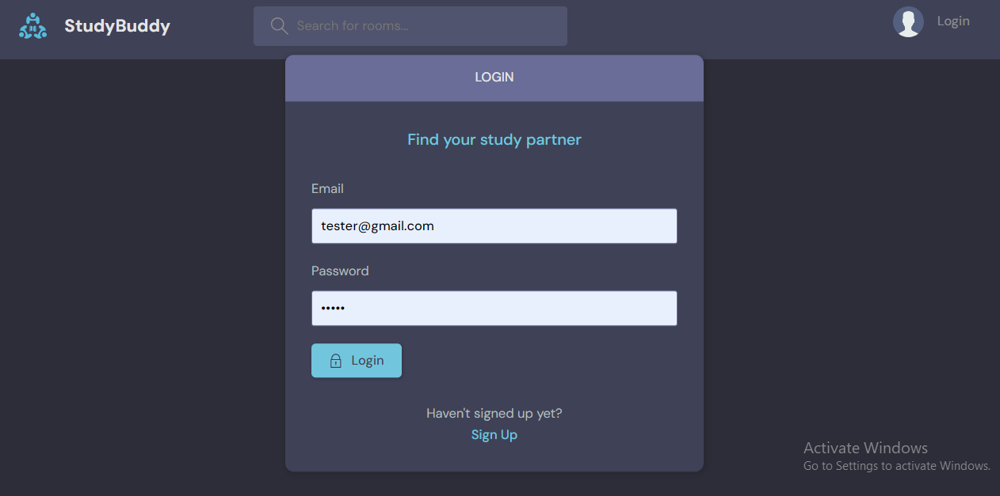
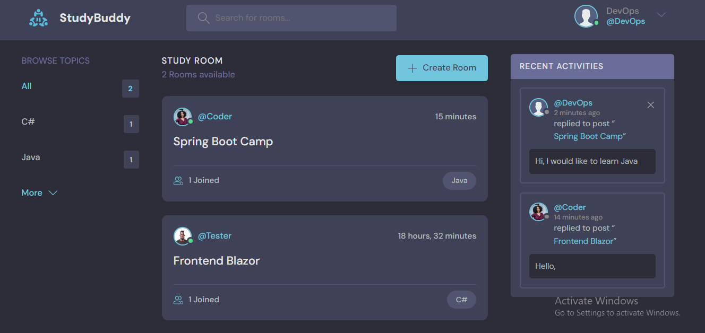
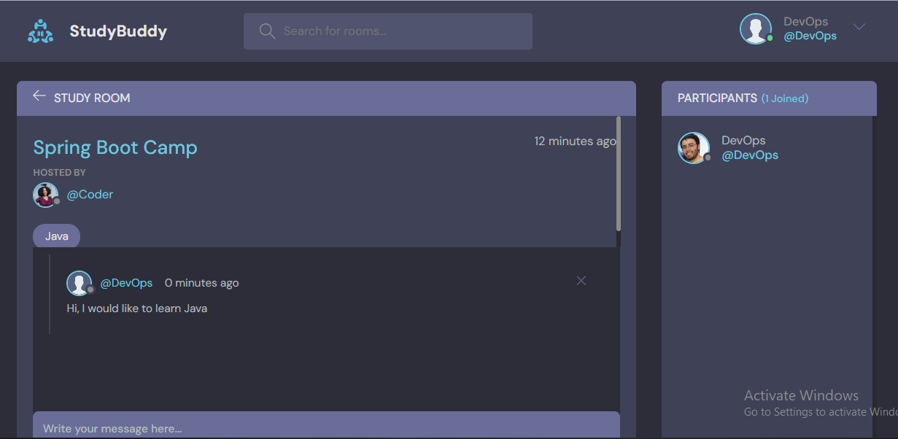

# StudyBuddy Application 
The field of software engineering demands constant learning , guidance and collaboration with other experienced teams , senior developers and even peers. This is the goal of StudyBuddy, to help find study partners, friends, collaborators.
It is a full-stack application built with HTML, CSS, JavaScript, Django framework and Django REST API.

